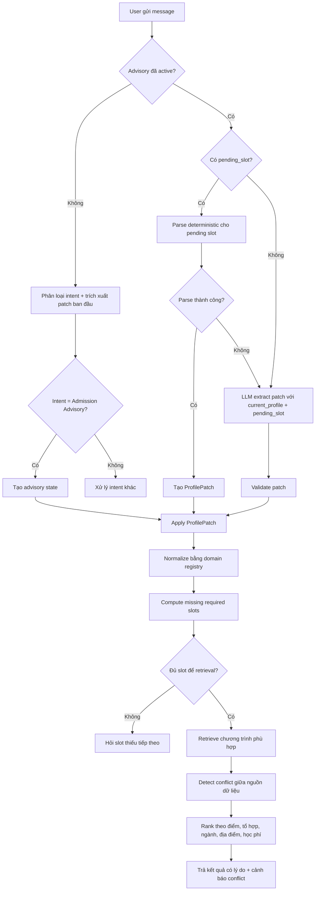

# Use case lý tưởng: Tư vấn chọn ngành/trường phù hợp cho thí sinh có hồ sơ chưa đầy đủ và thay đổi yêu cầu trong quá trình tư vấn

## 1. Mục tiêu use case

Hệ thống hỗ trợ một học sinh lớp 12 chưa biết chính xác nên chọn trường/ngành nào. Qua nhiều lượt hội thoại, hệ thống:

1. Thu thập hồ sơ tuyển sinh tối thiểu.
2. Hiểu sở thích nghề nghiệp dù người dùng chưa biết tên ngành chính thức.
3. Cho phép người dùng sửa thông tin đã cung cấp.
4. Chỉ truy vấn và đề xuất trường khi đã đủ dữ liệu quan trọng.
5. Giải thích rõ khi dữ liệu tuyển sinh giữa các nguồn có khác biệt.
6. Đưa ra danh sách lựa chọn phù hợp kèm lý do và thông tin còn cần xác minh.

Use case này phù hợp để kiểm thử các slot đang có trong `profile_inference_service`, như điểm, tổ hợp, ngành mong muốn, trường mong muốn, khu vực, học phí và ràng buộc; đồng thời nó cho thấy vì sao cần bổ sung `admission_year` vào profile. 

---

# 2. Persona người dùng

**Người dùng:** Minh, học sinh lớp 12 tại Hải Phòng.

**Tình huống ban đầu:**

* Đang xét tuyển đại học năm 2026.
* Dự kiến thi được khoảng 26–27 điểm.
* Chưa biết rõ tên ngành, chỉ biết thích lập trình và AI.
* Muốn học ở Hà Nội.
* Gia đình có giới hạn học phí.
* Muốn biết trường nào phù hợp và khả năng trúng tuyển ra sao.

---

# 3. Kịch bản hội thoại lý tưởng

## Turn 1 — Người dùng bắt đầu bằng nhu cầu mơ hồ

### User

> Em đang học lớp 12, thích lập trình với AI nhưng chưa biết nên chọn ngành hay trường nào.

### Hệ thống cần hiểu

Người dùng đang có ý định tư vấn tuyển sinh, nhưng mới cung cấp sở thích, chưa cung cấp đủ dữ liệu để đề xuất trường chính xác.

### Profile patch mong muốn

```json
{
  "operations": [
    {
      "op": "add",
      "slot": "inferred_interest_tags",
      "value": "software_development",
      "evidence": "thích lập trình"
    },
    {
      "op": "add",
      "slot": "inferred_interest_tags",
      "value": "artificial_intelligence",
      "evidence": "AI"
    }
  ]
}
```

### State sau lượt này

```json
{
  "admission_year": null,
  "total_score": null,
  "subject_combination": null,
  "explicit_preferred_majors": [],
  "inferred_interest_tags": [
    "software_development",
    "artificial_intelligence"
  ],
  "preferred_schools": [],
  "location_preference": null,
  "tuition_budget": null,
  "constraints": []
}
```

### Response lý tưởng của hệ thống

> Dựa trên sở thích lập trình và AI, em có thể phù hợp với các hướng như Công nghệ thông tin, Khoa học máy tính, Kỹ thuật phần mềm, Khoa học dữ liệu hoặc Trí tuệ nhân tạo.
>
> Trước tiên, em đang xét tuyển cho năm nào?

### Điểm quan trọng

Hệ thống **không nên lập tức coi người dùng đã chọn ngành AI hoặc một chương trình cụ thể của UET**. Đây mới chỉ là sở thích dùng để gợi ý và xếp hạng ngành về sau.

---

## Turn 2 — Người dùng trả lời ngắn cho slot đang chờ

### User

> 2026 ạ.

### Context tại thời điểm xử lý

```json
{
  "pending_slot": "admission_year"
}
```

### Xử lý lý tưởng

Không cần gọi general intent router.
Không cần extract lại toàn bộ profile.
Có thể parse trực tiếp bằng rule-based parser.

### Profile patch mong muốn

```json
{
  "operations": [
    {
      "op": "set",
      "slot": "admission_year",
      "value": 2026,
      "evidence": "2026"
    }
  ]
}
```

### Response lý tưởng

> Mình đã ghi nhận em xét tuyển năm 2026. Điểm thi hoặc điểm dự kiến của em khoảng bao nhiêu?

---

## Turn 3 — Người dùng cung cấp điểm dự kiến

### User

> Chắc khoảng 27 điểm.

### Profile patch mong muốn

```json
{
  "operations": [
    {
      "op": "set",
      "slot": "total_score",
      "value": 27.0,
      "evidence": "khoảng 27 điểm"
    }
  ]
}
```

### Response lý tưởng

> Em dự kiến khoảng 27 điểm. Em xét tuyển theo tổ hợp nào, ví dụ A00, A01 hay D01?

### Điểm quan trọng

Hệ thống chưa nên retrieval kết quả trường/ngành ở đây, vì chưa biết tổ hợp xét tuyển.

---

## Turn 4 — Người dùng cung cấp thêm thông tin ngoài câu đang hỏi

### User

> Em thi A01, với muốn học ở Hà Nội thôi.

### Profile patch mong muốn

Một message cập nhật được nhiều slot:

```json
{
  "operations": [
    {
      "op": "set",
      "slot": "subject_combination",
      "value": "A01",
      "evidence": "thi A01"
    },
    {
      "op": "set",
      "slot": "location_preference",
      "value": "Ha Noi",
      "evidence": "muốn học ở Hà Nội"
    }
  ]
}
```

### State sau lượt này

```json
{
  "admission_year": 2026,
  "total_score": 27.0,
  "subject_combination": "A01",
  "explicit_preferred_majors": [],
  "inferred_interest_tags": [
    "software_development",
    "artificial_intelligence"
  ],
  "preferred_schools": [],
  "location_preference": "Ha Noi",
  "tuition_budget": null,
  "constraints": []
}
```

### Response lý tưởng

> Với sở thích lập trình và AI, tổ hợp A01, dự kiến 27 điểm và mong muốn học tại Hà Nội, em có thể cân nhắc các nhóm ngành:
>
> * Khoa học máy tính
> * Công nghệ thông tin
> * Kỹ thuật phần mềm
> * Khoa học dữ liệu
> * Trí tuệ nhân tạo
>
> Trong các hướng này, em muốn ưu tiên ngành nào nhất, hay muốn mình so sánh các lựa chọn phù hợp trước?

### Điểm quan trọng

Đây là lúc hệ thống có thể bắt đầu gợi ý nhóm ngành. Tuy nhiên, nếu retrieval chính thức cần ngành ưu tiên cụ thể, hệ thống vẫn nên hỏi thêm thay vì tự chốt.

---

## Turn 5 — Người dùng chọn ngành nhưng kèm ngân sách

### User

> Em ưu tiên Khoa học máy tính hoặc Khoa học dữ liệu. Học phí khoảng dưới 40 triệu một năm thì tốt.

### Profile patch mong muốn

```json
{
  "operations": [
    {
      "op": "add",
      "slot": "explicit_preferred_majors",
      "value": "computer_science",
      "evidence": "ưu tiên Khoa học máy tính"
    },
    {
      "op": "add",
      "slot": "explicit_preferred_majors",
      "value": "data_science",
      "evidence": "hoặc Khoa học dữ liệu"
    },
    {
      "op": "set",
      "slot": "tuition_budget",
      "value": {
        "currency": "VND",
        "period": "year",
        "maximum": 40000000
      },
      "evidence": "dưới 40 triệu một năm"
    }
  ]
}
```

### State đủ để retrieval

```json
{
  "admission_year": 2026,
  "total_score": 27.0,
  "subject_combination": "A01",
  "explicit_preferred_majors": [
    "computer_science",
    "data_science"
  ],
  "inferred_interest_tags": [
    "software_development",
    "artificial_intelligence"
  ],
  "location_preference": "Ha Noi",
  "tuition_budget": {
    "currency": "VND",
    "period": "year",
    "maximum": 40000000
  }
}
```

### Điều kiện retrieval

Lúc này hệ thống đã có các thông tin quan trọng:

| Slot          | Giá trị                             |
| ------------- | ----------------------------------- |
| Năm xét tuyển | 2026                                |
| Điểm dự kiến  | 27.0                                |
| Tổ hợp        | A01                                 |
| Ngành ưu tiên | Khoa học máy tính, Khoa học dữ liệu |
| Khu vực       | Hà Nội                              |
| Học phí       | Dưới 40 triệu/năm                   |

Hệ thống có thể gọi retrieval để tìm:

* chương trình tuyển sinh năm 2026;
* ngành phù hợp;
* tổ hợp A01 có được chấp nhận hay không;
* mức điểm tham khảo;
* học phí;
* dữ liệu xung đột giữa các nguồn.

---

# 4. Kết quả retrieval giả lập

Giả sử hệ thống tìm được ba lựa chọn:

```json
[
  {
    "school": "VNU-UET",
    "program": "Khoa học máy tính",
    "subject_combination_supported": true,
    "tuition_fit": true,
    "score_fit": "competitive",
    "data_conflict": {
      "field": "quota",
      "source_a": "120 chỉ tiêu",
      "source_b": "150 chỉ tiêu"
    }
  },
  {
    "school": "HUST",
    "program": "Khoa học dữ liệu và Trí tuệ nhân tạo",
    "subject_combination_supported": true,
    "tuition_fit": false,
    "score_fit": "reach",
    "data_conflict": null
  },
  {
    "school": "PTIT",
    "program": "Công nghệ thông tin",
    "subject_combination_supported": true,
    "tuition_fit": true,
    "score_fit": "safer",
    "data_conflict": null
  }
]
```

---

## Turn 6 — Hệ thống trình bày kết quả có giải thích

### Response lý tưởng

> Dựa trên hồ sơ hiện tại của em — xét tuyển năm 2026, dự kiến 27 điểm, tổ hợp A01, ưu tiên Khoa học máy tính/Khoa học dữ liệu, muốn học tại Hà Nội và học phí dưới 40 triệu/năm — mình đề xuất ba lựa chọn sau:
>
> ### 1. VNU-UET — Khoa học máy tính
>
> **Mức phù hợp: Cao**
>
> * Phù hợp với sở thích lập trình và AI của em.
> * Có hỗ trợ tổ hợp A01 theo dữ liệu tuyển sinh hiện có.
> * Học phí nằm trong mức ngân sách em mong muốn.
> * Điểm 27 được xem là có tính cạnh tranh, nhưng vẫn cần đối chiếu ngưỡng xét tuyển chính thức năm 2026.
>
> **Lưu ý dữ liệu:** Hai nguồn hiện ghi khác nhau về chỉ tiêu tuyển sinh: một nguồn ghi 120 chỉ tiêu, nguồn khác ghi 150 chỉ tiêu. Em nên kiểm tra thông báo tuyển sinh chính thức mới nhất của trường trước khi đăng ký.
>
> ### 2. PTIT — Công nghệ thông tin
>
> **Mức phù hợp: Khá cao, an toàn hơn**
>
> * Phù hợp với định hướng lập trình.
> * Có hỗ trợ A01.
> * Học phí phù hợp với ngân sách.
> * So với lựa chọn Khoa học máy tính tại UET, đây có thể là phương án an toàn hơn nếu em ưu tiên khả năng trúng tuyển.
>
> ### 3. HUST — Khoa học dữ liệu và Trí tuệ nhân tạo
>
> **Mức phù hợp học thuật: Cao, nhưng cần cân nhắc**
>
> * Rất sát với sở thích AI và dữ liệu.
> * Mức cạnh tranh có thể cao hơn với khoảng điểm dự kiến của em.
> * Học phí hiện vượt mức ngân sách em đưa ra.
>
> Em có muốn ưu tiên theo tiêu chí nào hơn: **khả năng trúng tuyển**, **đúng sở thích AI nhất**, hay **học phí an toàn nhất**?

---

# 5. Turn quan trọng: người dùng sửa thông tin đã cung cấp

Một use case lý tưởng không chỉ kiểm tra happy path, mà cần có correction.

## Turn 7 — Người dùng sửa điểm

### User

> À em vừa tính lại, chắc chỉ khoảng 25.75 thôi, không phải 27.

### Profile patch mong muốn

```json
{
  "disposition": "correction",
  "operations": [
    {
      "op": "replace",
      "slot": "total_score",
      "value": 25.75,
      "previous_value": 27.0,
      "evidence": "chỉ khoảng 25.75 thôi, không phải 27"
    }
  ]
}
```

### Hệ thống phải làm gì

1. Cập nhật `total_score` từ `27.0` thành `25.75`.
2. Không giữ kết quả ranking cũ như thể vẫn còn hợp lệ.
3. Chạy lại retrieval/ranking dựa trên điểm mới.
4. Thông báo rõ kết quả tư vấn đã thay đổi vì dữ liệu đầu vào thay đổi.

### Response lý tưởng

> Mình đã cập nhật điểm dự kiến của em từ 27 xuống 25.75. Với mức điểm mới, thứ tự ưu tiên nên điều chỉnh:
>
> * **PTIT — Công nghệ thông tin:** trở thành lựa chọn thực tế hơn về khả năng trúng tuyển và vẫn phù hợp ngân sách.
> * **VNU-UET — Khoa học máy tính:** vẫn phù hợp về sở thích, nhưng mức cạnh tranh sẽ cao hơn so với hồ sơ hiện tại.
> * **HUST — Khoa học dữ liệu và Trí tuệ nhân tạo:** nên xem là lựa chọn thử sức vì cả cạnh tranh và học phí đều ít phù hợp hơn.
>
> Em có muốn mình chia danh sách thành ba nhóm: **an toàn**, **vừa sức** và **thử sức** không?

---

# 6. Turn kiểm thử thêm: người dùng thay đổi constraint

## Turn 8 — Người dùng thay đổi khu vực

### User

> Nếu có trường phù hợp hơn thì em học ở miền Bắc cũng được, không nhất thiết Hà Nội.

### Profile patch mong muốn

```json
{
  "operations": [
    {
      "op": "replace",
      "slot": "location_preference",
      "value": "Mien Bac",
      "previous_value": "Ha Noi",
      "evidence": "miền Bắc cũng được, không nhất thiết Hà Nội"
    }
  ]
}
```

### Ý nghĩa

Hệ thống mở rộng search space từ:

```text id="mno9e7"
Hà Nội
```

sang:

```text id="j3a2hj"
Miền Bắc
```

và có thể bổ sung các trường phù hợp ngoài Hà Nội.

---

# 7. Luồng xử lý nội bộ lý tưởng



---

# 8. Các slot cần có trong use case này

## Slot tối thiểu để bắt đầu retrieval chính xác

| Slot                                                      |                Bắt buộc? | Lý do                                           |
| --------------------------------------------------------- | -----------------------: | ----------------------------------------------- |
| `admission_year`                                          |                       Có | Dữ liệu tuyển sinh thay đổi theo năm            |
| `total_score`                                             |                       Có | Dùng đánh giá mức phù hợp/trúng tuyển           |
| `subject_combination`                                     |                       Có | Xác định chương trình có chấp nhận tổ hợp không |
| `explicit_preferred_majors` hoặc `inferred_interest_tags` |                       Có | Xác định ngành cần tìm                          |
| `location_preference`                                     | Không bắt buộc tuyệt đối | Dùng xếp hạng/lọc địa điểm                      |
| `tuition_budget`                                          | Không bắt buộc tuyệt đối | Dùng xếp hạng/lọc tài chính                     |
| `constraints`                                             | Không bắt buộc tuyệt đối | Dùng cá nhân hóa tư vấn                         |
| `preferred_schools`                                       |           Không bắt buộc | Dùng ưu tiên hoặc so sánh cụ thể                |

## State cuối use case

```json
{
  "admission_year": 2026,
  "total_score": 25.75,
  "subject_combination": "A01",
  "explicit_preferred_majors": [
    "computer_science",
    "data_science"
  ],
  "inferred_interest_tags": [
    "software_development",
    "artificial_intelligence"
  ],
  "preferred_schools": [],
  "location_preference": "Mien Bac",
  "tuition_budget": {
    "currency": "VND",
    "period": "year",
    "maximum": 40000000
  },
  "constraints": []
}
```

---

# 9. Vì sao đây là use case lý tưởng để demo và test hệ thống?

Use case này kiểm tra được gần như toàn bộ điểm khó của hệ thống tư vấn tuyển sinh:

| Khía cạnh cần kiểm tra                        | Có trong use case |
| --------------------------------------------- | ----------------: |
| Người dùng bắt đầu bằng yêu cầu mơ hồ         |                Có |
| Infer sở thích thành nhóm ngành               |                Có |
| Thu thập slot qua nhiều lượt                  |                Có |
| Trả lời cụt theo `pending_slot`               |                Có |
| Một câu cập nhật nhiều slot                   |                Có |
| Chỉ retrieval khi đủ dữ liệu                  |                Có |
| Lọc theo năm, điểm, tổ hợp, địa điểm, học phí |                Có |
| Phát hiện dữ liệu nguồn mâu thuẫn             |                Có |
| Giải thích lý do đề xuất                      |                Có |
| Người dùng sửa dữ liệu cũ                     |                Có |
| Chạy lại ranking sau correction               |                Có |
| Người dùng nới constraint để mở rộng kết quả  |                Có |

---

# 10. Acceptance Criteria cho use case

## AC1 — Thu thập năm xét tuyển

**Given** hệ thống đang tư vấn tuyển sinh
**When** người dùng trả lời `"2026"` cho câu hỏi về năm xét tuyển
**Then** state phải cập nhật:

```json
{
  "admission_year": 2026
}
```

---

## AC2 — Không retrieval khi chưa có tổ hợp

**Given** hệ thống đã biết năm tuyển sinh, điểm và sở thích ngành
**And** chưa biết `subject_combination`
**When** hệ thống chuẩn bị đề xuất chương trình cụ thể
**Then** phải hỏi tổ hợp xét tuyển trước
**And** không trả về kết luận về khả năng phù hợp chính thức.

---

## AC3 — Nhận nhiều thông tin trong một câu

**Given** hệ thống đang hỏi tổ hợp xét tuyển
**When** người dùng trả lời `"Em thi A01, với muốn học ở Hà Nội thôi"`
**Then** state phải cập nhật đồng thời:

```json
{
  "subject_combination": "A01",
  "location_preference": "Ha Noi"
}
```

---

## AC4 — Phân biệt sở thích suy luận và ngành lựa chọn rõ ràng

**Given** người dùng nói `"thích lập trình với AI"`
**Then** hệ thống chỉ cập nhật `inferred_interest_tags`
**And** chưa coi đây là ngành đã được người dùng xác nhận.

**When** người dùng nói `"Em ưu tiên Khoa học máy tính hoặc Khoa học dữ liệu"`
**Then** hệ thống cập nhật `explicit_preferred_majors`.

---

## AC5 — Lọc kết quả theo ngân sách

**Given** người dùng đặt ngân sách dưới 40 triệu/năm
**When** hệ thống xếp hạng trường/ngành
**Then** chương trình vượt ngân sách phải được đánh dấu rõ
**And** không được xếp hạng như lựa chọn tối ưu nếu còn chương trình phù hợp ngân sách.

---

## AC6 — Giải thích dữ liệu mâu thuẫn

**Given** hai nguồn ghi khác nhau về chỉ tiêu của cùng chương trình tuyển sinh
**When** chương trình đó được đề xuất
**Then** hệ thống phải hiển thị thông tin có xung đột
**And** nói rõ trường dữ liệu nào đang khác nhau
**And** khuyến nghị kiểm tra nguồn chính thức mới nhất.

---

## AC7 — Sửa điểm làm thay đổi ranking

**Given** kết quả ban đầu được xếp hạng với `total_score = 27.0`
**When** người dùng sửa điểm thành `25.75`
**Then** state phải thay thế điểm cũ
**And** hệ thống phải chạy lại ranking
**And** giải thích rằng thứ tự đề xuất thay đổi do điểm dự kiến thay đổi.

---

## AC8 — Nới địa điểm làm mở rộng kết quả

**Given** người dùng ban đầu chỉ muốn học tại Hà Nội
**When** người dùng sửa thành `"miền Bắc cũng được"`
**Then** state phải cập nhật location preference
**And** search space phải được mở rộng sang các trường phù hợp trong miền Bắc.

---

## Kết luận

Use case tốt nhất cho hệ thống của bạn là:

> **Một thí sinh chưa biết rõ ngành/trường, bắt đầu bằng sở thích cá nhân; hệ thống lần lượt thu thập năm xét tuyển, điểm, tổ hợp, địa điểm và ngân sách; sau đó đề xuất các chương trình phù hợp, giải thích dữ liệu xung đột, đồng thời xử lý đúng khi người dùng sửa điểm hoặc thay đổi điều kiện ưu tiên.**

Đây là use case đủ thực tế cho demo, đồng thời buộc kiến trúc phải xử lý đúng các yêu cầu cốt lõi: **stateful profile inference, pending slot, patch update, retrieval gating, conflict-aware recommendation và re-ranking khi profile thay đổi**.
