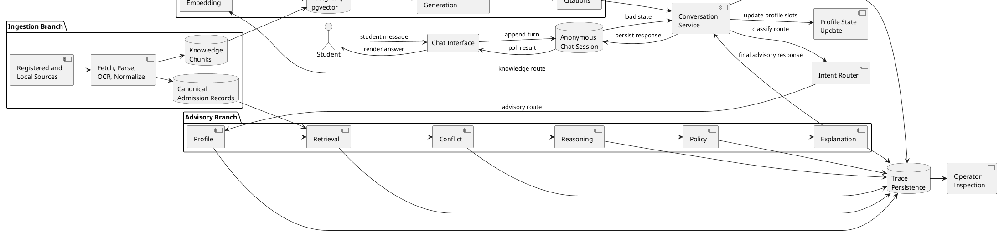

# Thesis LaTeX Revision Implementation Plan

> **For agentic workers:** REQUIRED SUB-SKILL: Use superpowers:subagent-driven-development (recommended) or superpowers:executing-plans to implement this plan task-by-task. Steps use checkbox (`- [ ]`) syntax for tracking.

**Goal:** Revise the thesis LaTeX content to address supervisor feedback on concision, data preparation, contribution framing, prompt templates, and the system architecture diagram without changing the mandated six-chapter skeleton, `latex/main.tex`, or template formatting.

**Architecture:** This is a documentation-only revision under `latex/`. The plan adds one PlantUML architecture source, updates existing chapter prose in place, keeps `latex/OUTLINE.md` synchronized, and verifies structure with text scans because no local LaTeX toolchain is available.

**Tech Stack:** LaTeX subfiles, PlantUML source files, PowerShell structural checks, existing thesis facts in `latex/FACTS.md`, existing code/docs as factual sources.

---

## Ground Rules

- Do not edit `latex/main.tex`, `latex-template/`, chapter filenames, chapter order, margins, fonts, or the six-chapter skeleton.
- Keep thesis prose in American English. Vietnamese may appear inside quoted prompt input examples, source titles, school names, and placeholders such as `{{message}}`.
- Do not introduce new numeric claims unless they are already in `latex/FACTS.md` or are produced by a command run during implementation.
- Do not leave unresolved verification tags in changed chapter files at completion.
- Keep one sentence per source line where practical.
- If PlantUML rendering is unavailable locally, commit only `latex/Figure/src/system_architecture_flow.puml` and reference it with an explicit rendering note in the plan execution notes, not in thesis prose.

## File Structure

- Create: `latex/Figure/src/system_architecture_flow.puml`
  - Responsibility: Source for the Chapter 2 system-level runtime flow diagram.
- Optional create: `latex/Figure/system_architecture_flow.png`
  - Responsibility: Rendered diagram included by Chapter 2, only if an existing local PlantUML tool can generate it.
- Modify: `latex/Chapter/2_Survey.tex`
  - Responsibility: Add the architecture diagram and prose explaining runtime design, answer generation, embeddings, vector search, ingestion, and trace persistence.
- Modify: `latex/Chapter/3_Methodology.tex`
  - Responsibility: Tighten Chapter 3 around need, selected approach, alternatives, and rationale.
- Modify: `latex/Chapter/4_Experiment_evaluation.tex`
  - Responsibility: Add a `Data preparation` subsection under `Application building` before `Libraries and tools`.
- Modify: `latex/Chapter/5_Solution_contribution.tex`
  - Responsibility: Add an opening problem-summary section and tighten first paragraphs of contribution sections.
- Modify: `latex/Chapter/Appendix_A.tex`
  - Responsibility: Add academic prompt-template appendix content with reproducible templates, not production prompts.
- Modify: `latex/OUTLINE.md`
  - Responsibility: Reflect the revised Chapter 2, Chapter 4, Chapter 5, and Appendix A contents.

## Task 1: Baseline Structural Snapshot

**Files:**
- Read: `latex/CLAUDE.md`
- Read: `latex/OUTLINE.md`
- Read: `latex/FACTS.md`
- Read: `latex/Chapter/2_Survey.tex`
- Read: `latex/Chapter/3_Methodology.tex`
- Read: `latex/Chapter/4_Experiment_evaluation.tex`
- Read: `latex/Chapter/5_Solution_contribution.tex`
- Read: `latex/Chapter/Appendix_A.tex`
- Read: `latex/reference.bib`
- Read: `latex/Figure/src/*.puml`

- [ ] **Step 1: Confirm the worktree state**

Run:

```powershell
git status --short
```

Expected: either no output, or unrelated user changes that must not be reverted.

- [ ] **Step 2: Confirm target file sections**

Run:

```powershell
Select-String -Path latex\Chapter\2_Survey.tex,latex\Chapter\3_Methodology.tex,latex\Chapter\4_Experiment_evaluation.tex,latex\Chapter\5_Solution_contribution.tex,latex\Chapter\Appendix_A.tex -Pattern '\\(section|subsection|subsubsection)\{'
```

Expected: section and subsection headings for Chapters 2-5 and Appendix A. Use this output to place edits without changing chapter skeleton files.

- [ ] **Step 3: Confirm existing bibliography keys used by planned prose**

Run:

```powershell
Select-String -Path latex\reference.bib -Pattern '@.*\{(gemini|geminiteam2023|lewis2020rag|postgresql|pgvector|langgraph|langgraph_docs|fastapi|pydantic|pdfplumber|pymupdf|docker|pytest)'
```

Expected: all listed keys exist. If any key is missing, stop and inspect `latex/reference.bib` before writing citation-bearing prose.

- [ ] **Step 4: Commit nothing**

No commit is made in this task because it only records baseline context.

## Task 2: Add Chapter 2 System Architecture Diagram Source

**Files:**
- Create: `latex/Figure/src/system_architecture_flow.puml`
- Optional create: `latex/Figure/system_architecture_flow.png`
- Modify later in Task 3: `latex/Chapter/2_Survey.tex`

- [ ] **Step 1: Write the PlantUML source**

Create `latex/Figure/src/system_architecture_flow.puml` with this exact content:



- [ ] **Step 2: Run a source-only sanity check**

Run:

```powershell
Select-String -Path latex\Figure\src\system_architecture_flow.puml -Pattern '@startuml|@enduml|Advisory Branch|Knowledge Branch|Ingestion Branch|Trace'
```

Expected: matches for start/end markers and all four conceptual areas.

- [ ] **Step 3: Try to render only if PlantUML is already installed**

Run:

```powershell
Get-Command plantuml -ErrorAction SilentlyContinue
```

Expected if installed: a command record for `plantuml`.
Expected if unavailable: no output.

If installed, run:

```powershell
plantuml -tpng -o .. latex\Figure\src\system_architecture_flow.puml
```

Expected if installed: `latex\Figure\system_architecture_flow.png` exists.

If unavailable, do not create a PNG and do not invent one.

- [ ] **Step 4: Commit diagram source**

If only the PlantUML source exists, run:

```bash
git add latex/Figure/src/system_architecture_flow.puml
git commit -m "docs: add thesis system architecture diagram source"
```

If the PNG was generated locally, run this command instead:

```bash
git add latex/Figure/src/system_architecture_flow.puml latex/Figure/system_architecture_flow.png
git commit -m "docs: add thesis system architecture diagram source"
```

## Task 3: Add Chapter 2 Architecture Diagram Prose

**Files:**
- Modify: `latex/Chapter/2_Survey.tex`
- Requires: `latex/Figure/system_architecture_flow.png` if rendered, otherwise leave this task blocked until the image is rendered externally.

- [ ] **Step 1: Insert the figure and prose after the business process paragraph**

In `latex/Chapter/2_Survey.tex`, locate this paragraph in `\subsection{Business process}`:

```latex
An advisory-flow message proceeds only when all critical profile slots are filled; otherwise the system asks the next missing question.
Once the profile is sufficient, the run is dispatched to a background executor that drives the six-stage advisory pipeline --- profile, retrieve, conflict, reason, policy, explain --- and persists the final answer together with a per-stage trace.
The chat interface polls for the result and renders both the recommendation and, for the operator, the stage trace.
```

Immediately after it, insert this block:

```latex
Figure~\ref{fig:system-architecture-flow} summarizes the same behavior at system level, including the branches that feed and observe the runtime path.

\begin{figure}[H]
    \centering
    \includegraphics[width=\textwidth]{system_architecture_flow.png}
    \caption{System-level runtime flow from student message to final response}
    \label{fig:system-architecture-flow}
\end{figure}

The student-facing path starts at the chat interface, where a message is appended to an anonymous session rather than to a named user account.
The conversation service loads the current profile state, applies deterministic profile updates when the message contains recognizable slot values, and asks the intent router to choose the next route only after those state updates have been applied.
This ordering is intentional: a short answer to a pending question or a correction to a previous score should update the consultation state before the system decides whether to continue profile collection, start an advisory run, answer a factual question, or handle a hybrid comparison.

When the selected route is advisory, answer generation follows the fixed pipeline shown earlier in Figure~\ref{fig:activity-advisory}.
The profile stage prepares the collected student state, retrieval queries the canonical admission and cutoff records, conflict detection preserves contradictory source values, reasoning ranks candidates against the student's method and score, policy checks admission constraints, and explanation turns the resulting evidence into a student-readable answer.
Each stage writes a trace event, so the operator can inspect not only the final recommendation but also the intermediate state that produced it.

When the selected route is knowledge question answering, the system uses semantic similarity rather than keyword matching alone.
The question is embedded into the same vector space as the stored knowledge chunks.
PostgreSQL with pgvector compares the query vector with stored chunk vectors using cosine distance, returning the most similar chunks within the school and topic scope.
The answer-generation call is grounded in those retrieved chunks and returns cited source identifiers; if the retrieved chunks are not relevant enough, the system states that it has no data instead of producing an unsupported answer.

The ingestion branch supplies both runtime stores.
Registered admission sources and local knowledge documents are fetched, parsed, transcribed by OCR when needed, normalized, chunked, embedded, and inserted into the database.
Structured records feed the advisory branch, while embedded chunks feed the knowledge branch.
The same database also stores chat sessions and trace events, which keeps student dialogue, retrieved evidence, and operator inspection tied to one observable run.
```

- [ ] **Step 2: If the PNG is not available, use the explicit external-rendering note outside thesis prose**

If `latex/Figure/system_architecture_flow.png` does not exist, do not insert the figure block yet. Instead, record this execution note at the top of the task checklist in the commit message body or plan execution log:

```text
PlantUML source added at latex/Figure/src/system_architecture_flow.puml. Render latex/Figure/system_architecture_flow.png externally before enabling the Chapter 2 \includegraphics block.
```

The final thesis must not contain an `\includegraphics` reference to a missing image.

- [ ] **Step 3: Verify the label and reference**

Run:

```powershell
Select-String -Path latex\Chapter\2_Survey.tex -Pattern 'fig:system-architecture-flow|system_architecture_flow.png|semantic similarity|pgvector|trace event'
```

Expected: matches for the figure label, image filename, semantic similarity prose, pgvector prose, and trace event prose.

- [ ] **Step 4: Commit Chapter 2 revision**

Run:

```bash
git add latex/Chapter/2_Survey.tex
git commit -m "docs: add chapter 2 architecture flow explanation"
```

If the PNG was not available and Chapter 2 was not modified, skip this commit and leave Task 3 unchecked.

## Task 4: Rewrite Chapter 3 for Concision and Decision Logic

**Files:**
- Modify: `latex/Chapter/3_Methodology.tex`

- [ ] **Step 1: Replace the Chapter 3 opening paragraph**

Replace the opening prose before `\section{Large language models and structured output}` with:

```latex
Chapter~\ref{chapter:Related_works} defined the system requirements: grounded answers, conflict-tolerant recommendations, graceful degradation under model failures, traceable advisory runs, and a responsive chat interface.
This chapter explains the technical choices made to satisfy those requirements.
Each section follows the same decision logic: the system need, the selected approach, the main alternative, and the reason for the selection.
Section~\ref{section:3.1} covers hosted \gls{LLM}s and structured output, Section~\ref{section:3.2} covers retrieval-augmented generation and vector search, Section~\ref{section:3.3} covers the fixed advisory graph, Section~\ref{section:3.4} covers document processing and \gls{OCR}, and Section~\ref{section:3.5} covers the web stack.
```

- [ ] **Step 2: Replace Section 3.1 with concise hosted Gemini and fallback prose**

Replace the full body of `\section{Large language models and structured output}` up to the next `\section` with:

```latex
\section{Large language models and structured output}
\label{section:3.1}

The system needs language-model behavior in places where deterministic parsing is too brittle: routing a free-form student message, extracting profile updates from conversational text, resolving selected source conflicts, generating grounded answers, and transcribing scanned pages.
These tasks do not require training a new model; they require reliable calls to a capable hosted model with clear input and output contracts.

The selected approach is to use the Gemini family through a shared inference gateway~\cite{gemini,geminiteam2023}.
Gemini's multimodal interface is useful because the same gateway can handle both text tasks and page-image \gls{OCR}.
Each call site sends a role-specific prompt and, when downstream code consumes the result, requires strict \gls{JSON} rather than free prose.
The returned text is parsed into typed service models before it can affect routing, profile state, or answer generation.

The main alternative was to call a hosted model directly from every service or to run a local open-weight model.
Direct calls would duplicate retry, telemetry, and parsing logic across the codebase.
A local model would reduce provider dependence, but it would add deployment and hardware cost outside the project's scope.
The gateway-based hosted approach keeps the model boundary explicit: hard \gls{API} failures and malformed structured outputs are detected in one place, retries and fallback models are applied consistently, and deterministic fallbacks can be used by call sites when the model cannot return a usable result.
```

- [ ] **Step 3: Replace Section 3.2 with concise RAG and pgvector rationale**

Replace the full body of `\section{Retrieval-augmented generation and vector search}` up to the next `\section` with:

```latex
\section{Retrieval-augmented generation and vector search}
\label{section:3.2}

The knowledge-answering route needs current, source-grounded answers about tuition, programs, scholarships, regulations, and school-specific documents.
A bare \gls{LLM} cannot satisfy this need because the relevant admission material changes during the admission season and may never have appeared in the model's training data.
Retrieval-augmented generation addresses this by retrieving relevant passages from an external corpus and constraining generation to those passages~\cite{lewis2020rag}.

The selected approach stores document chunks as embeddings and retrieves them by semantic similarity.
Each chunk and each question is mapped to a dense vector; semantically related texts are close under cosine distance.
PostgreSQL with pgvector stores these vectors and supports nearest-neighbor search through the cosine-distance operator~\cite{postgresql,pgvector}.
The knowledge service embeds the question, searches the scoped chunk set, passes the retrieved chunks to the model, and attaches citations to the source documents used in the answer.

The main alternative was a dedicated vector database.
That choice would be reasonable for a much larger corpus or for specialized vector operations, but it would add another datastore to deploy and keep consistent with the relational admission data.
The thesis system already depends on PostgreSQL for sessions, traces, canonical records, cutoff records, and migrations.
Keeping vectors in the same database is sufficient for the measured corpus size recorded in `latex/FACTS.md` and lets advisory data, knowledge chunks, and traceable session state remain in one operational store.
```

- [ ] **Step 4: Replace Section 3.3 with fixed LangGraph versus open-ended loop prose**

Replace the full body of `\section{Agentic pipelines}` up to the next `\section` with:

```latex
\section{Agentic pipelines}
\label{section:3.3}

The advisory route needs a multi-stage decision process, not a single model answer.
The system must collect or update a profile, retrieve candidate programs, detect source conflicts, reason about eligibility, apply policy constraints, and explain the result.
The order of these stages should be predictable because recommendations are inspected by operators and may be re-run after a student correction.

The selected approach is a fixed LangGraph state graph~\cite{langgraph,langgraph_docs}.
Nodes read and write a shared typed state, and edges define the six-stage sequence: profile, retrieval, conflict, reasoning, policy, and explanation.
This structure gives every run the same stage names and the same control flow, which is why trace events can be persisted per stage and rendered in the operator panel.

The main alternative was an open-ended function-calling loop in which a model chooses tools until it decides that the task is complete.
That style is flexible, but the model controls the run-time sequence, making failures harder to reproduce and stage-level traces harder to compare.
For admission advising, the task shape is stable and the risk of an opaque tool sequence is higher than the value of improvisation.
The fixed graph was therefore chosen for determinism, traceability, and testable service boundaries.
```

- [ ] **Step 5: Replace Section 3.4 with concise OCR comparison**

Replace the full body of `\section{Document processing}` up to the next `\section` with:

```latex
\section{Document processing}
\label{section:3.4}

The ingestion layer must process official sources that arrive as \gls{HTML} pages, born-digital \gls{PDF}s, and scanned \gls{PDF}s.
Machine-readable pages can be parsed directly, but scanned proposal documents have no text layer and require \gls{OCR}.
The system therefore needs a document path that recovers usable text without making scanned files a separate project.

The selected approach is hybrid extraction.
For born-digital pages, the pipeline extracts the embedded text and tables using pdfplumber~\cite{pdfplumber}.
For scanned pages, it renders page images with PyMuPDF~\cite{pymupdf} and sends only those image pages through the multimodal inference gateway for transcription.
This keeps the cost proportional to the number of scanned pages and reuses the same hosted Gemini integration used by the other model-backed services.

The main alternative was a separate OCR engine.
That would reduce dependence on the hosted model for transcription, but it would add installation, language tuning, image preprocessing, and a second failure surface.
Vietnamese admission documents also mix tables, diacritics, scanned signatures, and layout artifacts, so the practical cost of tuning a separate OCR path is high.
Reusing the gateway is simpler for this project, while degenerate-output detection and retry protect the pipeline from the main observed model-OCR failure mode.
```

- [ ] **Step 6: Replace Section 3.5 with concise web stack rationale and chapter summary**

Replace the full body of `\section{Web stack}` through the chapter summary with:

```latex
\section{Web stack}
\label{section:3.5}

The web layer needs to accept a student message immediately while advisory work continues in the background.
It also needs typed boundaries between routes, services, repositories, and inference calls so that malformed input or model output does not spread through the system.

The selected approach is FastAPI served by Uvicorn, with server-rendered Jinja2 templates and client-side polling for run completion~\cite{fastapi,uvicorn,jinja2}.
The message endpoint records the turn and returns quickly; the advisory run executes on a background thread pool and writes its result and trace to the database.
Pydantic models define the service contracts used by the chat layer, inference gateway, knowledge service, and profile state handling~\cite{pydantic}.

The main alternative was to introduce a separate task queue and worker service.
That would be appropriate for high-volume production traffic, but it would add a broker and another deployment unit.
For this thesis system, a small number of long, \gls{API}-bound runs can be handled by the existing process, while the database remains the durable handoff point between request handling, background execution, polling, and trace inspection.

This chapter connected each technology choice to a requirement and an alternative.
The system uses hosted Gemini calls behind a resilient gateway, \gls{RAG} over pgvector for grounded answers, a fixed LangGraph graph for deterministic advisory runs, hybrid extraction for mixed document formats, and an asynchronous FastAPI stack for non-blocking chat.
Chapter~\ref{chapter:Experiment} next describes how these choices are assembled into the implemented system.
```

- [ ] **Step 7: Verify Chapter 3 no longer reads as technology survey padding**

Run:

```powershell
Select-String -Path latex\Chapter\3_Methodology.tex -Pattern 'selected approach|main alternative|fixed LangGraph|dedicated vector database|separate OCR engine|task queue'
```

Expected: matches showing explicit decision logic and alternatives.

- [ ] **Step 8: Commit Chapter 3 revision**

Run:

```bash
git add latex/Chapter/3_Methodology.tex
git commit -m "docs: tighten chapter 3 technology rationale"
```

## Task 5: Add Chapter 4 Data Preparation Subsection

**Files:**
- Modify: `latex/Chapter/4_Experiment_evaluation.tex`
- Read: `ingestion/registry/seeds/initial_sources.json`
- Read: `ingestion/cutoff/seeds/cutoff_2023_2025.json`
- Read: `ingestion/knowledge/registry/seeds/knowledge_sources.json`
- Read: `ingestion/knowledge/seeds/national_sources.json`
- Read: `ingestion/knowledge/crawler/seeds/crawler_targets.json`
- Read: `data/knowledge/manifest.json`
- Read: `latex/FACTS.md`

- [ ] **Step 1: Re-read factual sources**

Run:

```powershell
Get-Content -Raw ingestion\registry\seeds\initial_sources.json
Get-Content -Raw ingestion\cutoff\seeds\cutoff_2023_2025.json
Get-Content -Raw ingestion\knowledge\registry\seeds\knowledge_sources.json
Get-Content -Raw ingestion\knowledge\seeds\national_sources.json
Get-Content -Raw ingestion\knowledge\crawler\seeds\crawler_targets.json
Get-Content -Raw data\knowledge\manifest.json
Get-Content -Raw latex\FACTS.md
```

Expected: sources load successfully. Use only values already recorded in `latex/FACTS.md` for numeric totals.

- [ ] **Step 2: Insert `Data preparation` before `Libraries and tools`**

In `latex/Chapter/4_Experiment_evaluation.tex`, locate:

```latex
\section{Application building}
\label{section:4.3}

\subsection{Libraries and tools}
```

Replace it with:

```latex
\section{Application building}
\label{section:4.3}

\subsection{Data preparation}

The application data was prepared through two complementary paths: structured admission records for advisory reasoning and unstructured knowledge documents for grounded question answering.
The structured path starts from the source registry seed at \texttt{ingestion/registry/seeds/initial\_sources.json}, which defines the configured university sources used by the ingestion \gls{CLI}.
Historical cutoff data is loaded from the cutoff seed files under \texttt{ingestion/cutoff/seeds/}.
Together, these sources populate the canonical admission and cutoff tables used by retrieval, conflict detection, and reasoning.

The knowledge-corpus path starts from four registries.
School-level knowledge sources are listed in \texttt{ingestion/knowledge/registry/seeds/knowledge\_sources.json}.
National regulation sources are listed in \texttt{ingestion/knowledge/seeds/national\_sources.json}.
Crawler targets are listed in \texttt{ingestion/knowledge/crawler/seeds/crawler\_targets.json}.
The local document manifest is stored in \texttt{data/knowledge/manifest.json}, with born-digital \gls{PDF}s organized under \texttt{data/knowledge/pdf\_text} and scanned \gls{PDF}s organized under \texttt{data/knowledge/pdf\_scanned}.
This separation lets the pipeline choose text-layer extraction for machine-readable files and multimodal \gls{OCR} for scanned documents.

The processing sequence is the same across the corpus.
First, discovery or manifest loading identifies candidate documents and their school, topic, and source metadata.
Second, manifest filtering removes disabled or out-of-scope entries before expensive processing begins.
Third, the pipeline extracts a text layer when available or renders scanned pages and transcribes them by \gls{OCR}.
Fourth, the resulting text is split into chunks with stable source identifiers.
Fifth, the chunks are embedded and inserted into the PostgreSQL knowledge tables, where pgvector indexes support later similarity search.

The final numeric totals are reported only in the Achievement subsection below.
Keeping the counts there avoids duplicating evaluation claims while this subsection explains how the data became usable.

\subsection{Libraries and tools}
```

- [ ] **Step 3: Verify subsection order**

Run:

```powershell
Select-String -Path latex\Chapter\4_Experiment_evaluation.tex -Pattern '\\subsection\{Data preparation\}|\\subsection\{Libraries and tools\}|\\subsection\{Achievement\}'
```

Expected: `Data preparation` appears before `Libraries and tools`, and `Achievement` remains after the library table.

- [ ] **Step 4: Verify no duplicated numeric corpus claims in the new subsection**

Run:

```powershell
Select-String -Path latex\Chapter\4_Experiment_evaluation.tex -Pattern 'Data preparation|18 documents|406|715|28\{,}\055'
```

Expected: numeric totals such as `18 documents`, `406`, `715`, and `28{,}055` appear in Achievement, not in the new Data preparation subsection.

- [ ] **Step 5: Commit Chapter 4 revision**

Run:

```bash
git add latex/Chapter/4_Experiment_evaluation.tex
git commit -m "docs: add thesis data preparation subsection"
```

## Task 6: Reframe Chapter 5 Contributions

**Files:**
- Modify: `latex/Chapter/5_Solution_contribution.tex`

- [ ] **Step 1: Replace the Chapter 5 opening prose before Section 5.1**

Replace the current opening paragraphs before `\section{Conflict-aware data consolidation}` with:

```latex
Chapter~\ref{chapter:Experiment} presented the implemented system as a whole.
This chapter isolates the thesis contributions and frames each one around the problem it solves, the solution implemented in this repository, and the result observed in the system.

\section{Problems addressed}
\label{section:5.0}

The first problem is contradictory official admission data.
Admission proposals, school pages, and cutoff sources can disagree on the same program, year, method, or quota.
An advisory assistant that silently overwrites one value with another would hide uncertainty from the student, so the system must preserve conflicting records and disclose decision-changing conflicts.

The second problem is unreliable external \gls{LLM} behavior.
The system depends on hosted models for routing, profile extraction, conflict tie-breaking, grounded generation, and \gls{OCR}; those calls can fail through network errors, quota limits, or malformed structured outputs.
The contribution is not simply using a model, but designing the gateway and fallbacks so those failures do not collapse the consultation.

The third problem is heterogeneous source material.
Useful admission knowledge appears in configured \gls{HTML} pages, structured seeds, born-digital \gls{PDF}s, and scanned \gls{PDF}s.
The system therefore needs an ingestion path that can collect, normalize, chunk, embed, and store material across formats without treating scanned documents as unusable.

The following sections detail the three contributions that address these problems: conflict-aware data consolidation, a resilient inference gateway, and end-to-end ingestion of heterogeneous official sources.
```

- [ ] **Step 2: Tighten the first paragraph of Section 5.1**

In `\section{Conflict-aware data consolidation}`, replace the first `\textbf{Problem.}` paragraph block with:

```latex
\textbf{Problem.}
Official admission data is fragmented and can be internally inconsistent.
Two authoritative publications for the same program may state different quotas, and cutoff sources may disagree for the same program, year, and method.
Because Chapter~\ref{chapter:Related_works} identified conflict disclosure as a missing capability in existing channels, the system must keep disagreement visible instead of collapsing it into one apparently certain value.
The broader database problem is data fusion over records that describe the same entity but disagree on attributes~\cite{bleiholder2009fusion}; this thesis applies a conservative strategy that defers conflicts when the system cannot settle them objectively.
```

- [ ] **Step 3: Tighten the first paragraph of Section 5.2**

In `\section{Resilient LLM inference gateway}`, replace the first `\textbf{Problem.}` paragraph block with:

```latex
\textbf{Problem.}
Hosted \gls{LLM} calls fail in ways that ordinary service calls do not fully capture.
A hard failure means the provider cannot return a response because of network, authentication, quota, or rate-limit conditions.
A structure failure means the provider returned text, but the text cannot be parsed into the schema required by downstream code.
Both failures are expected in a system that asks models for strict \gls{JSON}, and either one can break routing or answer generation unless the model boundary treats failure types explicitly.
```

- [ ] **Step 4: Tighten the first paragraph of Section 5.3**

In `\section{End-to-end ingestion of heterogeneous official sources}`, replace the first `\textbf{Problem.}` paragraph block with:

```latex
\textbf{Problem.}
The data that makes the assistant useful is spread across formats that require different handling.
Structured school pages can be fetched and parsed, proposal documents may contain extractable text and tables, and scanned \gls{PDF}s provide only page images.
Without a unified ingestion path across those formats, the canonical store would miss structured advisory facts and the knowledge corpus would miss the documents needed for grounded answers.
```

- [ ] **Step 5: Verify Chapter 5 problem-solution-result framing**

Run:

```powershell
Select-String -Path latex\Chapter\5_Solution_contribution.tex -Pattern '\\section\{Problems addressed\}|contradictory official admission data|malformed structured outputs|heterogeneous source material|\\textbf\{Problem\.\}|\\textbf\{Solution\.\}|\\textbf\{Result\.\}'
```

Expected: one `Problems addressed` section, all three problem summaries, and each contribution still has Problem/Solution/Result markers.

- [ ] **Step 6: Commit Chapter 5 revision**

Run:

```bash
git add latex/Chapter/5_Solution_contribution.tex
git commit -m "docs: reframe thesis contributions around solved problems"
```

## Task 7: Add Appendix Prompt Templates

**Files:**
- Modify: `latex/Chapter/Appendix_A.tex`

- [ ] **Step 1: Append the prompt-template section before `\end{document}`**

In `latex/Chapter/Appendix_A.tex`, insert this block immediately before `\end{document}`:

```latex
\section*{A.5 Prompt template summaries}

The templates below are academic summaries of the prompt contracts used by the system.
They are not full production prompts; they show the role, task, required inputs, output format, and safety constraints needed to reproduce the behavior at design level.
Placeholders use double braces to distinguish run-time values from fixed instructions.

\textbf{Template A.5.1 --- Intent routing.}
\textit{Role:} classify one student message for a Vietnamese university admission assistant.
\textit{Task:} choose the next conversation route after deterministic profile updates have been applied.
\textit{Required inputs:} `{{message}}`, `{{profile_state}}`, `{{pending_slot}}`, and `{{recent_turns}}`.
\textit{Output format:} strict JSON with fields `route`, `confidence`, `school_scope`, `knowledge_topics`, `profile_reset_requested`, and `reason`.
\textit{Safety constraints:} return only a supported route; prefer `knowledge` for factual school-policy questions; prefer `advisory` only when the user asks for recommendation or eligibility guidance; return `clarification` when the message is ambiguous; do not fabricate missing profile values.

\textbf{Template A.5.2 --- Profile state update.}
\textit{Role:} extract admission-profile changes from a student message.
\textit{Task:} update only the fields supported by the profile schema and preserve prior values unless the message clearly corrects them.
\textit{Required inputs:} `{{message}}`, `{{profile_state}}`, `{{pending_slot}}`, and `{{validation_rules}}`.
\textit{Output format:} strict JSON with fields `updates`, `corrections`, `rejections`, `missing_critical_slots`, and `next_question`.
\textit{Safety constraints:} reject scores outside the valid range for the admission method; distinguish explicit preferred majors from inferred interests; never treat location or tuition as critical blocking slots; ask one missing critical slot at a time.

\textbf{Template A.5.3 --- Knowledge question answering.}
\textit{Role:} answer a student question using only retrieved official-source chunks.
\textit{Task:} synthesize a concise answer grounded in the supplied passages and return the identifiers of the chunks actually used.
\textit{Required inputs:} `{{question}}`, `{{school_scope}}`, `{{topic_scope}}`, and `{{retrieved_chunks}}`.
\textit{Output format:} strict JSON with fields `has_answer`, `answer`, `used_source_ids`, `missing_information`, and `confidence`.
\textit{Safety constraints:} do not use outside knowledge; set `has_answer` to false when the chunks do not answer the question; include no citation identifier that is absent from `{{retrieved_chunks}}`; state uncertainty when the passages conflict.

\textbf{Template A.5.4 --- OCR transcription.}
\textit{Role:} transcribe one page image from an official admission document.
\textit{Task:} recover the visible Vietnamese and English text while preserving table row order as plain text.
\textit{Required inputs:} `{{image_page}}`, `{{document_title}}`, `{{page_number}}`, and `{{school_scope}}`.
\textit{Output format:} plain UTF-8 text with line breaks that reflect the page layout.
\textit{Safety constraints:} transcribe only visible content; do not summarize; do not infer hidden table cells; mark unreadable spans as `[unreadable]`; stop rather than repeating a character or line indefinitely.

\textbf{Template A.5.5 --- Hybrid synthesis and policy ambiguity.}
\textit{Role:} synthesize advisory evidence and knowledge evidence when a student asks a comparison or policy-sensitive question.
\textit{Task:} combine candidate-program evidence, cutoff or quota conflicts, and retrieved knowledge chunks into one answer.
\textit{Required inputs:} `{{message}}`, `{{profile_state}}`, `{{advisory_evidence}}`, `{{retrieved_chunks}}`, and `{{conflict_summary}}`.
\textit{Output format:} strict JSON with fields `answer`, `comparison_points`, `policy_caveats`, `conflict_disclosures`, `used_source_ids`, and `follow_up_question`.
\textit{Safety constraints:} do not resolve policy ambiguity by guessing; disclose decision-changing conflicts; keep advisory recommendations separate from factual school descriptions; ask a follow-up question when a required profile value is missing.
```

- [ ] **Step 2: Verify prompt-template placeholders and output fields**

Run:

```powershell
Select-String -Path latex\Chapter\Appendix_A.tex -Pattern 'A\.5 Prompt template summaries|\{\{message\}\}|\{\{profile_state\}\}|\{\{retrieved_chunks\}\}|\{\{image_page\}\}|strict JSON|Safety constraints'
```

Expected: all four required placeholders appear, plus strict JSON and safety constraint wording.

- [ ] **Step 3: Commit Appendix A revision**

Run:

```bash
git add latex/Chapter/Appendix_A.tex
git commit -m "docs: add reproducible prompt template appendix"
```

## Task 8: Update `latex/OUTLINE.md`

**Files:**
- Modify: `latex/OUTLINE.md`

- [ ] **Step 1: Update Chapter 2 outline bullet**

In `latex/OUTLINE.md`, under Chapter 2, replace the existing `2.2.3 Business process` bullet with:

```markdown
- [~] 2.2.3 Business process: profile collection -> retrieval -> conflict
      check -> reasoning -> policy -> explanation (mirrors `graph.py`);
      includes a system-level architecture flow diagram covering anonymous
      chat sessions, routing/profile update, advisory and knowledge branches,
      ingestion feeds, and trace persistence.
```

- [ ] **Step 2: Update Chapter 3 outline bullets**

Replace the Chapter 3 section with:

```markdown
## Chapter 3 -- Theoretical background and technologies (<= 10 pages)
Rule: each technology maps to a Chapter 2 requirement + selected approach + alternative + rationale.
- [~] 3.1 LLMs and structured output: hosted Gemini through the inference
      gateway, strict JSON contracts, retries/fallbacks, alternative direct
      calls or local model.
- [~] 3.2 RAG + vector search: grounded answers, embeddings, cosine similarity
      in pgvector, alternative dedicated vector database.
- [~] 3.3 Agentic pipelines: fixed LangGraph graph versus open-ended
      function-calling loop; determinism and traceability.
- [~] 3.4 Document processing: hybrid text-layer extraction and hosted
      multimodal OCR versus separate OCR engine.
- [~] 3.5 Web stack: FastAPI/Jinja2/background executor and typed Pydantic
      boundaries; alternative task queue deferred.
```

- [ ] **Step 3: Update Chapter 4 outline bullets**

Under Chapter 4, replace the `4.3.1 Libraries/tools table` and `4.3.2 Achievement` bullets with:

```markdown
- [~] 4.3.1 Data preparation: canonical admission and cutoff seeds,
      knowledge-source registries, crawler targets, local PDF manifest,
      `data/knowledge/pdf_text`, `data/knowledge/pdf_scanned`, extraction/OCR,
      chunking, embedding, and database insertion.
- [~] 4.3.2 Libraries/tools table: versions from `requirements.txt` /
      `pyproject.toml` (verify).
- [~] 4.3.3 Achievement: LOC, package/test counts, ingested schools
      HUST/NEU/UET + MOET documents -- all measured values in `latex/FACTS.md`
      (2026-06-08: hust 136 programs, cutoffs 715 total, catalog 81,
      knowledge docs 18 / chunks 406, 28,055 Python LOC, 856 tests).
- [~] 4.3.4 Screenshots of main flows.
```

- [ ] **Step 4: Update Chapter 5 and Appendix A outline bullets**

Replace the Chapter 5 section with:

```markdown
## Chapter 5 -- Solution and contribution (>= 5 pages)
Opening section summarizes the three solved problems before detailed contributions:
contradictory official admission data, external LLM failures/malformed structured
outputs, and heterogeneous source formats including scanned PDFs.
Each contribution remains problem -> solution -> result and cross-references Chapters 2/4.
- [~] 5.1 Conflict-aware data consolidation: contradictory quota/cutoff data
      across sources; `services/conflict/` detection + LLM tiebreaker;
      conflict surfacing in advisory answers.
- [~] 5.2 Resilient LLM inference gateway: API failures vs STRUCTURE_FAILURE,
      retry/fallback in `services/inference/gateway.py`, deterministic keyword
      fallback for intent classification (commit c2ef582).
- [~] 5.3 End-to-end heterogeneous ingestion: per-school configs, OCR with
      degenerate-output detection and retry (commit b41dd9f), normalization
      into the canonical store and chunking into the knowledge corpus.
```

Replace the Appendix A section with:

```markdown
## Appendix A -- Use case descriptions and prompt templates
- [~] Full specifications overflowing from Section 2.3.
- [~] Academic prompt-template summaries for intent routing, profile state
      update, knowledge question answering, OCR transcription, and hybrid
      synthesis/policy ambiguity. Templates include role, task, required input
      placeholders, output format, and safety constraints.
```

- [ ] **Step 5: Verify outline references**

Run:

```powershell
Select-String -Path latex\OUTLINE.md -Pattern 'system-level architecture flow|Data preparation|prompt-template|STRUCTURE_FAILURE|hybrid synthesis'
```

Expected: all revised outline topics appear.

- [ ] **Step 6: Commit outline update**

Run:

```bash
git add latex/OUTLINE.md
git commit -m "docs: sync thesis outline with revision plan"
```

## Task 9: Final Structural Verification

**Files:**
- Verify: `latex/Chapter/*.tex`
- Verify: `latex/OUTLINE.md`
- Verify: `latex/Figure/src/system_architecture_flow.puml`
- Verify optional: `latex/Figure/system_architecture_flow.png`

- [ ] **Step 1: Check for unresolved verification tags**

Run:

```powershell
$pattern = 'TO' + 'DO-VERIFY'
Select-String -Path latex\Chapter\*.tex -Pattern $pattern
```

Expected: no output.

- [ ] **Step 2: Check new figure label and image availability**

Run:

```powershell
Select-String -Path latex\Chapter\2_Survey.tex -Pattern 'fig:system-architecture-flow|system_architecture_flow.png'
Test-Path latex\Figure\system_architecture_flow.png
```

Expected if Chapter 2 includes the figure: both label and image reference appear, and `Test-Path` returns `True`.
Expected if PNG was unavailable: Chapter 2 does not include `system_architecture_flow.png`, and Task 3 remains unchecked.

- [ ] **Step 3: Scan references, citations, and glossary usage**

Run:

```powershell
Select-String -Path latex\Chapter\*.tex -Pattern '\\(ref|cite|gls)\{[^}]+\}' -AllMatches
```

Expected: output only uses existing chapter labels, citation keys from `latex/reference.bib`, and glossary entries from `latex/glossary.tex`.

- [ ] **Step 4: Check for likely Vietnamese prose outside prompt examples and proper nouns**

Run:

```powershell
Select-String -Path latex\Chapter\*.tex -Pattern '[àáạảãâầấậẩẫăằắặẳẵèéẹẻẽêềếệểễìíịỉĩòóọỏõôồốộổỗơờớợởỡùúụủũưừứựửữỳýỵỷỹđÀÁẠẢÃÂẦẤẬẨẪĂẰẮẶẲẴÈÉẸẺẼÊỀẾỆỂỄÌÍỊỈĨÒÓỌỎÕÔỒỐỘỔỖƠỜỚỢỞỠÙÚỤỦŨƯỪỨỰỬỮỲÝỴỶỸĐ]'
```

Expected: matches only inside quoted student examples, prompt-template descriptions that intentionally mention Vietnamese, document titles, or school names. If ordinary thesis prose is matched, rewrite it in English.

- [ ] **Step 5: Check for missing image references by filename**

Run:

```powershell
Select-String -Path latex\Chapter\*.tex -Pattern '\\includegraphics(?:\[[^\]]+\])?\{([^}]+)\}' -AllMatches
```

Expected: each image name exists under `latex/Figure/`. Confirm manually for the new `system_architecture_flow.png` if referenced.

- [ ] **Step 6: Review diff**

Run:

```powershell
git diff -- latex\Chapter\2_Survey.tex latex\Chapter\3_Methodology.tex latex\Chapter\4_Experiment_evaluation.tex latex\Chapter\5_Solution_contribution.tex latex\Chapter\Appendix_A.tex latex\OUTLINE.md latex\Figure\src\system_architecture_flow.puml
```

Expected: diff contains only the planned thesis revisions and no changes to `latex/main.tex` or `latex-template/`.

- [ ] **Step 7: Commit any verification-only fixes**

If verification required small prose or reference fixes, commit them:

```bash
git add latex/Chapter/2_Survey.tex latex/Chapter/3_Methodology.tex latex/Chapter/4_Experiment_evaluation.tex latex/Chapter/5_Solution_contribution.tex latex/Chapter/Appendix_A.tex latex/OUTLINE.md latex/Figure/src/system_architecture_flow.puml
```

If `latex/Figure/system_architecture_flow.png` exists and was changed, add it before the same commit:

```bash
git add latex/Figure/system_architecture_flow.png
```

Then run:

```bash
git commit -m "docs: finish thesis revision structural checks"
```

If there are no additional changes, do not create an empty commit.

## Self-Review

**Spec coverage:**
- Chapter 2 architecture diagram: covered by Tasks 2 and 3.
- Chapter 3 concision rewrite: covered by Task 4.
- Chapter 4 data preparation: covered by Task 5.
- Chapter 5 contribution framing: covered by Task 6.
- Appendix prompt templates: covered by Task 7.
- `OUTLINE.md` synchronization: covered by Task 8.
- Structural verification: covered by Task 9.

**Placeholder scan:**
- The plan does not ask implementers to fill unspecified text later.
- The only conditional path is PlantUML PNG generation, which is explicitly handled by blocking the Chapter 2 `\includegraphics` edit until the image exists.

**Type and name consistency:**
- Figure source name: `system_architecture_flow.puml`.
- Optional rendered image name: `system_architecture_flow.png`.
- Figure label: `fig:system-architecture-flow`.
- Chapter 5 opening section label: `section:5.0`.
- Prompt placeholders: `{{message}}`, `{{profile_state}}`, `{{retrieved_chunks}}`, and `{{image_page}}`.
