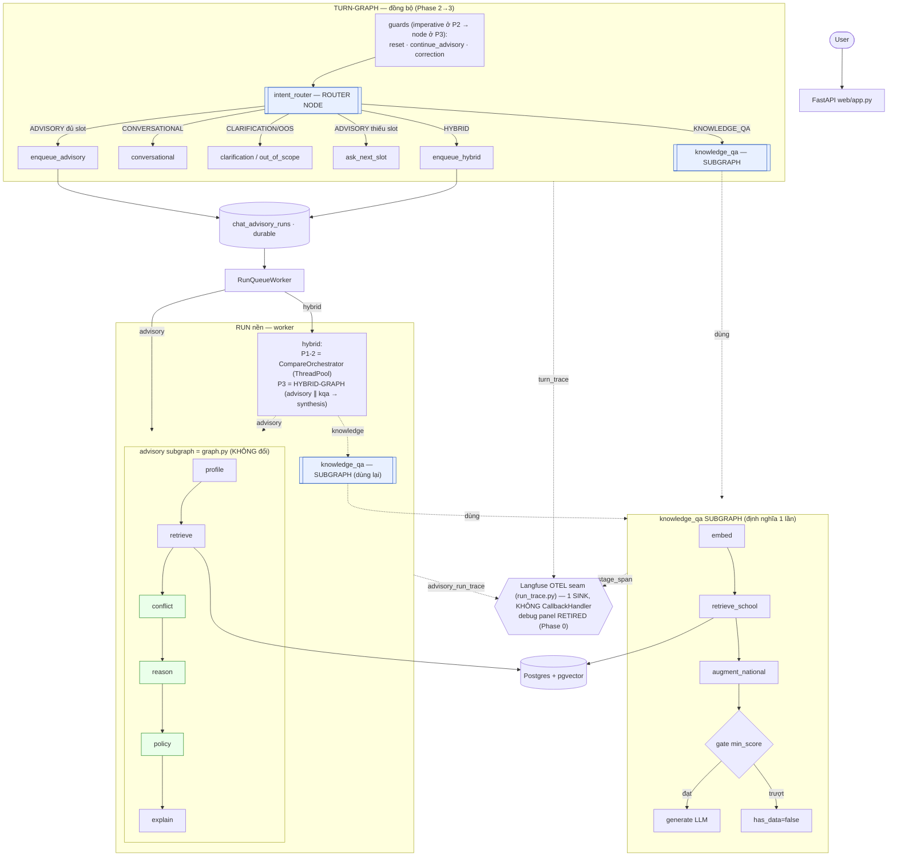
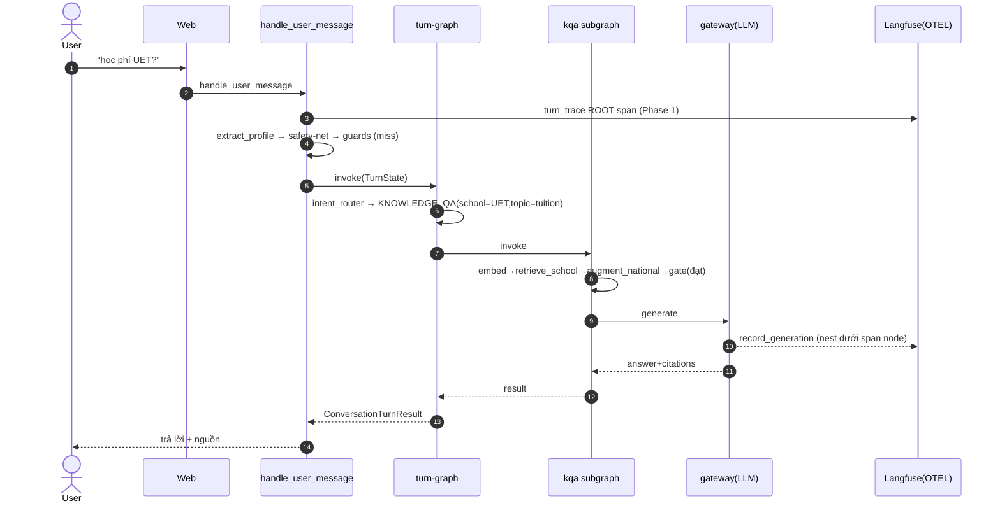
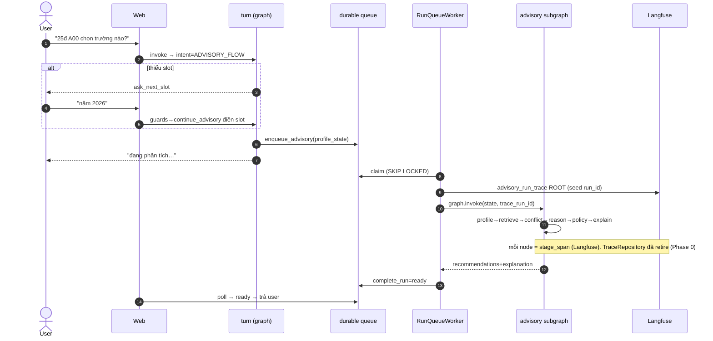
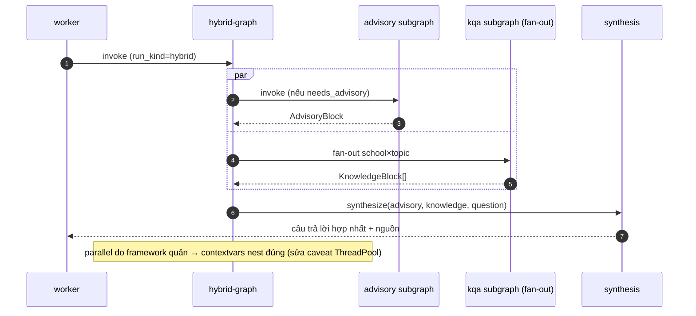

# Agent hóa luồng tư vấn trên LangGraph — Spec triển khai

**Ngày:** 2026-06-18
**Trạng thái:** Spec (đã qua brainstorm + adversarial verify với code) — chờ review để viết plan
**Supersedes:** bản brainstorm cùng tên (các diagram/§ đã được sửa theo phần "Đính chính" §0)

---

## 0. Đính chính so với bản brainstorm

Sau khi đối chiếu code thật, bản brainstorm có 5 điểm sai/thiếu — spec này đã sửa:

| # | Sai trong brainstorm | Bằng chứng | Sửa |
|---|---|---|---|
| 1 | "Bỏ `agent_tracer`, chuyển Langfuse `CallbackHandler`" gộp 2 việc khác nhau | `agent_tracer.traced` làm 2 việc: ghi `TraceRepository` (panel) **+** mở `stage_span` (Langfuse) (`agent_tracer.py:30-54`); Langfuse là seam OTEL tự chế (`run_trace.py`), LLM qua gateway bypass langchain (`gateway.py`) | **Quyết định:** retire panel (Phase 0) → `agent_tracer` **gọn còn nửa Langfuse** (KHÔNG xóa hẳn). **Không** CallbackHandler — lý do riêng: gateway bypass langchain (§11) |
| 2 | Hybrid là "RUN GRAPH advisory∥knowledge→synthesis" | Hybrid = `CompareOrchestrator` ThreadPool(2) imperative (`compare_orchestrator.py:25`) | Phase 3 mới LangGraph-hóa; trước đó gọi đúng tên "orchestrator" |
| 3 | knowledge_qa = "retrieve[national ∥ school]" | National là `vector_search` thứ 2 merge tuần tự + có confidence gate (`qa_service.py:77,112-127`) | Subgraph: embed→retrieve_school→augment_national→**gate**→generate; nhận `query_vector`/`national` injected |
| 4 | "advisory subgraph" mơ hồ | advisory đã là `StateGraph` chạy ở worker (`advisory_runner.py:30`) | Turn-graph nhúng node `enqueue`, **không** inline advisory |
| 5 | (thiếu) path đồng bộ under-traced | inline KQA/intent không có root span; chỉ worker có `advisory_run_trace` | Thêm `turn_trace` root span (Phase 1) |

---

## 1. Bối cảnh & vấn đề

Hệ thống hiện chạy tốt: pipeline tất định với LLM ở các seam cụ thể (intent, profile extract, knowledge generate, synthesis) + reasoning service. Cái gọi là "agent" trong `agents/` thực chất là **node tất định** của một LangGraph (`graph.py`). Đây là thiết kế **tốt** — auditable, testable, rẻ.

Yêu cầu: "agent hóa" intent_router / knowledge_qa / advisory; biến conflict/policy/reasoning/profile/retrieval/explanation thành subgraph (**hướng #1 — subgraph, KHÔNG LLM tool-calling**).

**Diễn giải đúng best-practice của yêu cầu** (north star của spec này):
> Biến orchestration từ **imperative if-else** thành **declarative graph + observability đồng nhất**, qua subgraph LangGraph; **giữ nguyên tính tất định** và **durable queue**. KHÔNG thêm autonomy LLM vào phần tất định.

Giá trị thật đạt được: (a) control-flow hiện trên sơ đồ, (b) **đóng gap tracing path đồng bộ**, (c) knowledge_qa thành subgraph tái dùng, (d) narrative kiến trúc cho thesis. **Không** phải thêm năng lực mới.

## 2. Mục tiêu / Ngoài phạm vi

**Mục tiêu**
- `intent_router` → router node; `knowledge_qa` → subgraph (sau facade service, blast radius nhỏ).
- Top-level **turn-graph** điều phối sau intent (Phase 2), tiến tới cả-turn (Phase 3/B).
- **Retire debug panel** (TraceRepository + viewer UI + endpoint), hợp nhất **1 sink trace = Langfuse** (Phase 0). `agent_tracer` gọn còn nửa Langfuse.
- Tracing đồng nhất: thêm `turn_trace` root cho path đồng bộ; tái dùng seam OTEL hiện có.
- Bảo toàn 100% hành vi (đặc biệt các edge-case EC-* trong collection) — khóa bằng test.

**Ngoài phạm vi**
- KHÔNG dùng LangChain/LangGraph `CallbackHandler` (lý do §0.1, §11).
- KHÔNG thay durable run queue bằng LangGraph checkpointer (persistence ≠ job queue).
- KHÔNG đưa LLM tool-calling/autonomy vào conflict/policy/reasoning.
- `interrupt()` cho slot-collection: **Phase 4 optional**, không cam kết.

## 3. Hiện trạng (đối chiếu code)

**Hai ngữ cảnh thực thi:**
1. **Turn đồng bộ** — `ConversationService.handle_user_message` (`services/chat/conversation_service.py:95`): history → `extract_profile` (LLM) → `_deterministic_safety_net` → guards (`_is_reset_request`, `_maybe_continue_advisory`, `_maybe_correction_rerun`) → `intent_router.classify` → `_handle_*`. **knowledge_qa inline** ở `_handle_knowledge_qa:348`.
2. **Run nền** — `enqueue_run` → `chat_advisory_runs` (Postgres, `SKIP LOCKED`) → `RunQueueWorker.poll_once` (`run_queue_worker.py:36`) → `RunDispatcher`/`HybridDispatcher`. Advisory = `run_advisory_for_session` → `graph.invoke(state)` (`advisory_runner.py:30`). Hybrid = `CompareOrchestrator` ThreadPool(2) advisory∥knowledge→`SynthesisAgent`.

**Tracing seam (langfuse v3 OTEL, tự chế):**
- `advisory_run_trace(run_id,…)` (`observability/run_trace.py:24`) = root span, seed `create_trace_id(seed=str(run_id))`. Chỉ bọc **run nền** (RunDispatcher/HybridDispatcher).
- `stage_span(stage,…)` = child span; `agent_tracer.traced` (`graph.py:31-36`) bọc mỗi node → mở `stage_span` **+ ghi `TraceRepository`** (debug panel).
- Generation nest tự động: `gateway.run` gọi `record_generation` (`run_trace.py:91`) dưới span đang active qua OTEL contextvars.
- ⚠️ Hybrid advisory branch chạy trong thread con ThreadPool → contextvars **không propagate** → stage-span có thể không nest (caveat hiện hữu).

**Versions:** `langgraph==1.1.10`, `langfuse>=3,<4` (`requirements.txt:15,19`). LangGraph v1 hỗ trợ subgraph, `Send` map-reduce, conditional edges, checkpointer, interrupt.

**knowledge_qa nội bộ** (`qa_service.py:53-159`): embed (precedence `query_vector`>`retrieval_query`>`question`) → `vector_search(school,topic)` → `_augment_with_national` (merge+sort) → **gate `confidence<min_score`→has_data=False** → `_generate` (LLM). Fan-out (school×topic) ở `knowledge_fanout.py` (ThreadPool, embed 1 lần + national 1 lần/topic).

## 4. Nguyên tắc thiết kế

1. **Tất định bất khả xâm phạm.** conflict/policy/reasoning giữ no-LLM; chỉ bọc thành node.
2. **Durable queue giữ nguyên.** Node nặng (advisory/hybrid) chỉ `enqueue`; worker chạy run-graph.
3. **Một sink trace duy nhất = Langfuse.** Retire panel (Phase 0): bỏ nửa `TraceRepository`. Mọi node (advisory/turn/kqa) dùng cùng decorator `stage_span` + extractors; generation nest qua `record_generation`. Không còn phân biệt "panel vs Langfuse-only".
4. **Facade trước, graph sau.** knowledge_qa subgraph nấp sau `KnowledgeQAService.answer()` (giữ chữ ký) → 3 caller (inline, fanout, compare) không đổi.
5. **Bảo toàn hành vi, khóa bằng test** trước mọi refactor (TDD characterization).

## 5. Kiến trúc đích (đã sửa)



## 6. Đặc tả component

### 6.1 knowledge_qa subgraph

**State** (`KQAState`, Pydantic v2):
```
question:str  school:str|None  topic:str|None  conversation_context:str=""
retrieval_query:str|None  query_vector:list|None  national:list|None   # injected hooks
embedding:list|None  chunks:list  confidence:float  result:KnowledgeQAResult|None
```

**Node** (map 1-1 với `answer()` hiện tại — không đổi logic):
- `embed`: precedence `query_vector` > `retrieval_query` > `question` (giữ y nguyên `qa_service.py:66-71`).
- `retrieve_school`: `vector_search(embedding, school, topic, top_k)`.
- `augment_national`: nếu `school ∉ {None, NATIONAL_SCHOOL}` → dùng `national` injected hoặc `national_chunks`; merge+sort.
- `gate` (conditional edge): `confidence = chunks[0].score`; `not chunks or confidence<min_score` → `no_data` (END, `has_data=False`); else → `generate`.
- `generate`: `_generate` (LLM) → answer + citations.

**Facade:** `KnowledgeQAService.answer(...)` giữ chữ ký, thân = `knowledge_qa_graph.invoke(KQAState(...))` rồi trả `result`. `retrieve()`/`generate_from_chunks()` (eval hook) gọi node tương ứng → eval không regress.

**Lưu ý batching:** subgraph **phải** nhận `query_vector`+`national` để fan-out giữ tối ưu "embed 1 lần / national 1 lần-topic". `embed`/`augment_national` no-op khi đã được inject.

### 6.2 turn-graph (Phase 2)

**State** (`TurnState`, Pydantic v2): `session_token, content, history_ctx, prev_user, profile_state:ChatProfileState, flow_state, delta:dict, intent:IntentResult|None, route:str|None, session_status:str, result:ConversationTurnResult|None, turn_id`.

**Node:**
- `intent_router`: gọi `IntentRouter.classify(content, profile_state, history)` → set `intent`,`route`. (Wrap classifier hiện có; **không** viết lại prompt/fallback.)
- Conditional edge theo `intent.route` → handler node, mỗi node bọc `_handle_*` hiện có (`_handle_knowledge_qa`→`kqa_inline` subgraph, `_handle_conversational`, `_handle_hybrid` enqueue, `_handle_out_of_scope`, `_handle_clarification`, `_handle_advisory`→ask/enqueue). Node viết `repository` + build `ConversationTurnResult` y như method gốc.

**Biên Phase 2:** `handle_user_message` giữ phần **trước intent** (extract, safety-net, guards) imperative; sau guards gọi `turn_graph.invoke(TurnState(...))`. Blast radius = chỉ phần routing.

### 6.3 hybrid-graph (Phase 3)

Thay `CompareOrchestrator` ThreadPool bằng LangGraph: node `branch` fan ra 2 nhánh song song (LangGraph parallel/`Send`): `advisory` (invoke advisory subgraph nếu `needs_advisory`) ∥ `knowledge` (fan-out school×topic → kqa subgraph) → node `synthesis` (`SynthesisAgent.synthesize`). Lợi: framework lo contextvars → **sửa caveat nesting cross-thread** (§3 ⚠️). Giữ degrade từng nhánh (block has_data=False).

### 6.4 advisory subgraph — KHÔNG đổi

`graph.py` giữ nguyên (`profile→retrieve→conflict→reason→policy→explain`), vẫn `graph.invoke` ở worker. Turn-graph **chỉ enqueue**. P3 hybrid-graph **gọi lại** advisory subgraph như sub-invoke.

### 6.5 Retire debug panel + Tracing (Phase 0)

**Retire panel — xóa:**
- Backend: `web/routes/chat_api.py:40-42` (endpoint `GET /{session_token}/trace`); `services/tracing/trace_service.py`; `services/tracing/trace_repository.py`.
- Frontend: `web/static/js/modules/trace.js` + ref trong `chat.js`, `modules/layout.js`, `templates/chat.html`.
- Tests: `tests/web/test_trace_endpoint_integration.py`; `tests/services/tracing/test_trace_repository*.py`; `test_trace_service.py`.
- DB: bảng `advisory_trace_events` (migration `011`) — để **dormant** (ngừng ghi) hoặc drop bằng migration mới `014` (numbered idempotent). Khuyến nghị dormant trước, drop sau khi chắc.

**Gọn `agent_tracer.traced`** — bỏ `repo.start_event/complete_event/fail_event`; giữ `stage_span(input=input_extractor)` + `set_span_output(output_extractor)`. `extractors.py` **giữ** (nuôi input/output cho Langfuse span). `STAGE_ORDER` chuyển vào `graph.py` (chỗ duy nhất còn cần thứ tự) hoặc bỏ nếu thừa.

**Tracing đồng nhất (1 sink):**
- **Thêm** `turn_trace(turn_id, session_token, user_message)` vào `run_trace.py` — mirror `advisory_run_trace`, root span seed theo `turn_id`. Bọc `handle_user_message` (hoặc `turn_graph.invoke`).
- Mọi node (advisory/turn/kqa) dùng **cùng** decorator `traced` (đã gọn) → `stage_span`. Generation nest qua `record_generation` của gateway + OTEL contextvars.
- **Tuyệt đối không** `langfuse.langchain.CallbackHandler` — gateway bypass langchain nên không bắt được generation; lại nhân đôi node-span.

**Phase 0 độc lập** với LangGraph: làm trước để decorator đã gọn khi nhân ra turn/kqa graph (không phải special-case panel).

## 7. Sequence (đã sửa)

### 7.1 KNOWLEDGE_QA (đồng bộ, có turn_trace)


### 7.2 ADVISORY (collect → enqueue → run nền)


### 7.3 HYBRID (P3: hybrid-graph)


## 8. Lộ trình (4 phase, rủi ro tăng dần, mỗi phase ship độc lập)

| Phase | Nội dung | Exit criteria | Rủi ro |
|---|---|---|---|
| **0** | Retire debug panel (xóa endpoint/trace_service/trace_repository/UI/tests); gọn `agent_tracer` còn nửa Langfuse; bảng `011` dormant | App chạy không endpoint `/trace`; advisory run vẫn lên Langfuse đủ stage; test còn lại xanh | **Thấp** |
| **1** | (a) knowledge_qa subgraph sau facade `answer()`; (b) `turn_trace` root span cho path đồng bộ | Test cũ xanh; inline KQA có trace cha trên Langfuse; eval hook không regress | **Thấp** |
| **2** | turn-graph: `intent_router` node + conditional routing + handler nodes; guards giữ imperative (biên A) | Characterization test toàn bộ route + EC-* xanh; hành vi byte-tương đương | **TB** |
| **3** | hybrid-graph (thay CompareOrchestrator); kéo guards vào turn-graph thành conditional-edge node (đạt B) | Hybrid parallel + nesting trace đúng; EC reset/continue/correction xanh | **TB-cao** |
| **4** *(optional)* | `interrupt()` cho slot-collection; cân nhắc bỏ `flow_state` thủ công | Chỉ làm nếu cần idiom HITL; có thể không làm | **Cao** |

**Khóa trước mọi phase:** characterization test (TDD) chụp hành vi hiện tại của `handle_user_message` cho mọi route + EC-* (memory: edge-case-compliance-matrix). Đây là lưới an toàn cho refactor.

## 9. Chiến lược test

- **Characterization (trước P2):** bộ test golden cho mọi `intent.route` + EC-04/07/22 + continue/correction, so khớp `ConversationTurnResult`.
- **knowledge_qa subgraph (P1):** parity test `answer()` cũ vs subgraph trên cùng input (gồm gate trượt, national injected, eval hook).
- **Trace (P0):** xóa test panel; assert advisory run lên Langfuse đủ 6 stage span; assert **không** còn ghi `TraceRepository`. **(P1-3):** assert turn_trace tạo root; generation nest dưới node span.
- **Hybrid (P3):** degrade từng nhánh; parity output vs CompareOrchestrator.
- Chạy trên `admission_test` (conftest auto-redirect — memory: dev-db-shared-with-tests).

## 10. Rủi ro & giảm thiểu

| Rủi ro | Giảm thiểu |
|---|---|
| Refactor routing làm vỡ EC-* | Characterization test trước (P2 gate) |
| Subgraph regress tối ưu batching fan-out | State nhận `query_vector`/`national` injected; parity test |
| Cross-thread contextvars (hybrid ThreadPool) nest sai | P3 LangGraph parallel; tới đó giữ caveat hiện hữu, không tệ hơn |
| Vô tình thêm CallbackHandler → span đôi | Ghi rõ non-goal; review chặn |
| Over-engineering: subgraph cho method 40 dòng | Chấp nhận có chủ đích (agent-arch goal + trace + thesis); facade giữ rủi ro thấp |

## 11. Phương án đã cân nhắc & loại

- **LangChain/LangGraph `CallbackHandler`** (best-practice *chung*): loại — LLM bypass langchain (gateway tự chế) nên CallbackHandler **không bắt** được generation; lại nhân đôi node-span với seam OTEL đã có. Generic best-practice giả định LLM gọi qua langchain — không đúng ở đây. Seam OTEL thủ công **đúng hơn**.
- **Giữ debug panel song song Langfuse:** loại (đã quyết) — 2 sink trùng, code thừa; Langfuse strictly dominate (generation/token/latency/session). Đánh đổi chấp nhận: debug cần mở Langfuse stack (docker), mất view nhúng in-app.
- **Hướng C toàn phần (checkpointer + interrupt thay queue + flow_state):** loại — persistence ≠ durable job queue; rip queue = thay nhầm công cụ; bề mặt regress lớn. Chỉ giữ `interrupt` như P4 optional.
- **Chỉ bọc 1 span quanh `answer()` thay vì subgraph:** đủ về tracing nhưng không đạt mục tiêu "knowledge_qa thành subgraph" của user + narrative thesis. Giữ subgraph, nhưng đây là fallback nếu muốn cắt scope P1.

## 12. Câu hỏi mở (chốt khi viết plan)

1. **fan-out (P3):** dùng `Send` map-reduce trong hybrid-graph, hay giữ ThreadPool gọi kqa-subgraph? (`Send` trace đẹp hơn, học phí cao hơn.)
2. **`TurnState` Pydantic vs TypedDict:** spec đề xuất Pydantic (đồng bộ `AgentState`); xác nhận khi plan.
3. **Bảng `011`:** dormant hay drop bằng migration `014`? (Spec đề xuất dormant trước.)
4. **Có làm P4 (`interrupt`) không**, hay dừng ở B?
```
